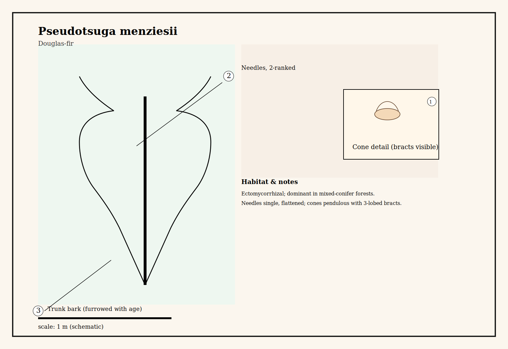

# Douglas-fir (Pseudotsuga menziesii)

Common name: Douglas-fir
Scientific name: Pseudotsuga menziesii
Date / Location: 
Observer: 

## Quick ID
- Habit: Tall, conical evergreen; stiff horizontal branches
- Needles: Single, flattened, soft, 2-ranked; blunt tip
- Bark: Thick, deeply furrowed on older trees; smoother on young
- Cones: Pendulous with distinctive three-pointed bracts

## Ecology
- Mycorrhizal type: Ectomycorrhizal (forms mantles and Hartig net)
- Typical associations: Dominant in mixed-conifer forests; networks with other ectomycorrhizal trees
- Soil / site: Well-drained upland soils; variable elevation

## Sketches
Main habit:

Root + mycorrhiza schematic:

## Herbal plate
Herbal-plate style illustrations (flat washes, ink outlines, numbered callouts). Use these plates as a composition reference for labeled parts and habitat notes.

*Caption: Herbal plate showing whole-tree schematic and inset cone detail.*

**Callouts (plate):**
- 1 — Cone detail (bracts visible)
- 2 — Needles, shown as two-ranked
- 3 — Trunk bark (furrowed on older trees)

*Caption: Root & mycorrhiza schematic (herbal plate).* 

**Callouts (root plate):**
- 1 — Coarse root (watercolor fill)
- 2 — Fungal mantle (schematic shading)

## Field notes
- DBH: 
- Canopy neighbors: 
- Fungi observed at base: 
- Notes on seedling regeneration / nurse logs: 

## Sketching cues
- Show scale bar (1 m and 10 cm)
- Draw needles in two ranks along twig; indicate cone bracts in close-up
- On root sketch, draw thick coarse roots and a mantle of fungal hyphae with fine branching lines for extraradical hyphae

## References & cross-links
- See template in ../species/template.md for page structure.

## Book notes (paraphrase)
Paraphrase of material in Suzanne Simard's Finding the Mother Tree: Mature Douglas‑fir are described as keystone canopy trees that participate in extensive ectomycorrhizal networks. Simard discusses experiments showing carbon transfer between established trees and seedlings through fungal connections, and highlights how mother trees can support regeneration, especially of related seedlings. The narrative also emphasizes management implications: preserving networked mothers aids forest resilience.

*Source: Simard, S. (2018). Finding the Mother Tree (paraphrased).* 

## Short quote (≤90 characters)
If you want a short exact quotation from the book (90 characters or fewer), paste it here and I will insert it with a citation. I cannot insert longer copyrighted passages, but I can add short quotes (≤90 chars) or additional paraphrases on request.
