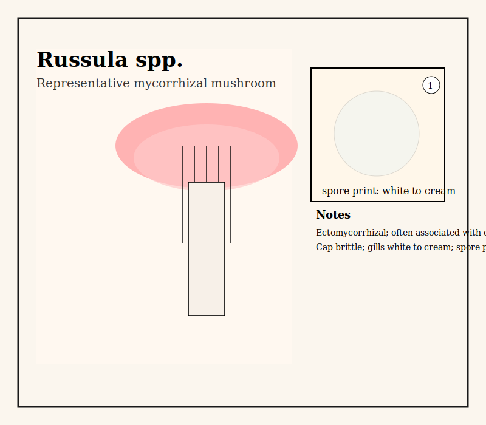
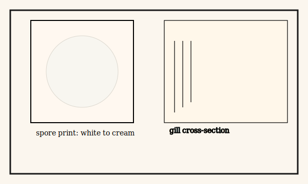

# Russula sp. (representative mycorrhizal mushroom)

Common name: Russula (group)
Scientific name: Russula spp.
Date / Location: 
Observer: 

## Quick ID
- Cap: Often brightly colored; convex to depressed with brittle flesh
- Gills: White to cream, brittle, adnate to slightly decurrent
- Stipe: Stout, brittle; often white
- Spore print: White to cream

## Ecology
- Mycorrhizal type: Ectomycorrhizal — forms symbioses with broadleaf and conifer hosts
- Typical associations: Associated with many tree species including Douglas-fir and hemlock
- Soil / site: Forest floor; often in leaf litter or mossy areas

## Sketches
Main habit / fruiting body:

Spore print and gill detail:

## Field notes
- Cap diameter: 
- Substrate: leaf litter / moss / rotten wood
- Nearby trees (probable hosts): 

## Sketching cues
- Draw a cross-section through cap to show gills and attachment to stipe
- Include a small spore-print box with color note

## References & cross-links
- See tree pages for likely host associations.

## Book notes (paraphrase)
Paraphrase of material in Finding the Mother Tree: Simard emphasizes the importance of mycorrhizal fungi (including common genera like Russula) as critical partners in forest networks. Fungi receive carbon from trees and in turn facilitate nutrient uptake and interplant transfers. Fruiting bodies such as Russula are visible indicators of these hidden networks that connect roots across the forest floor.

*Source: Simard, S. (2018). Finding the Mother Tree (paraphrased).* 

## Short quote (≤90 characters)
To include a short exact quote (90 characters or fewer) from the book about fungi, paste the line and I will insert it with a citation. I can't include longer copyrighted passages without your input.
