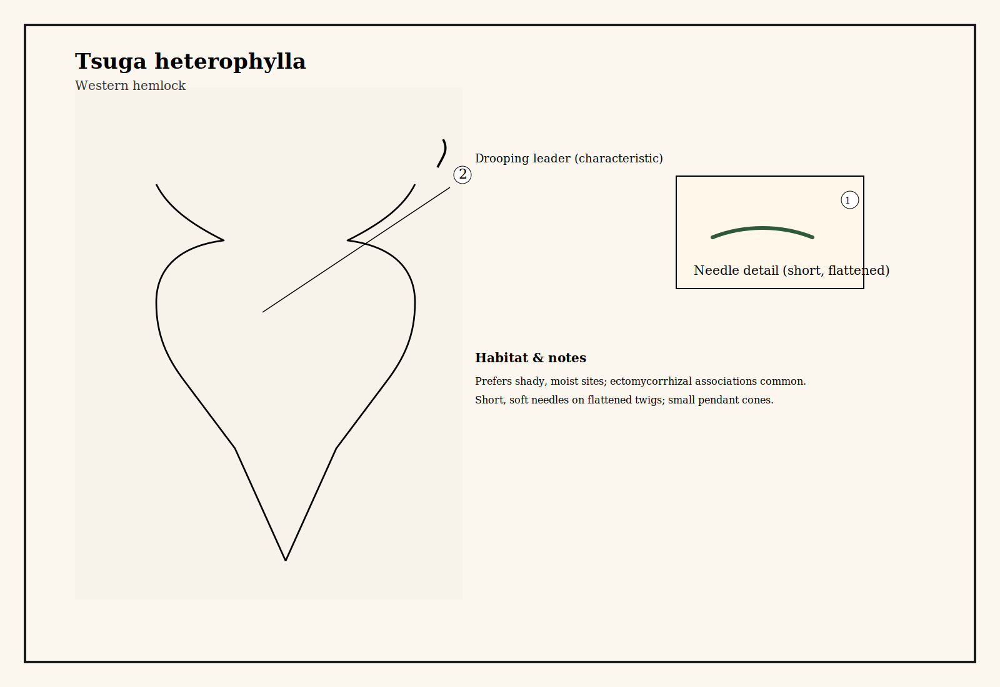
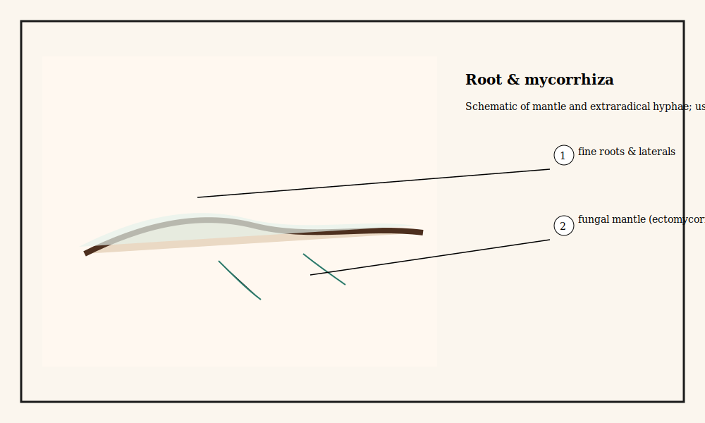

# Western hemlock (Tsuga heterophylla)

Common name: Western hemlock
Scientific name: Tsuga heterophylla
Date / Location: 
Observer: 

## Quick ID
- Habit: Narrow conical crown, drooping leader in older trees
- Needles: Short, soft, flattened, arranged spirally but appearing in two ranks
- Bark: Thin and scaly; deep furrows on large trees
- Cones: Small, pendant, with rounded scales

## Ecology
- Mycorrhizal type: Ectomycorrhizal
- Typical associations: Shady, moist sites; often under Douglas-fir canopy
- Soil / site: Moist, cool forests; tolerance for deep shade

## Sketches
Main habit:

Root + mycorrhiza schematic:

## Field notes
- DBH: 
- Canopy neighbors: 
- Fungi observed at base: 

## Sketching cues
- Show drooping leader and short needles; indicate fine root hairs with ectomycorrhizal mantles

## References & cross-links
- See Douglas-fir for notes on ectomycorrhizal network interactions.

## Book notes (paraphrase)
Paraphrase of material in Finding the Mother Tree: Western hemlock appears in Simard's account as a common shade‑tolerant component of mixed forests that participates in ectomycorrhizal networks. The book describes how understory species and shade‑tolerant trees both benefit from fungal connections that mediate nutrient and carbon flows, affecting seedling survival and community dynamics.

*Source: Simard, S. (2018). Finding the Mother Tree (paraphrased).* 

## Short quote (≤90 characters)
If you'd like a short exact quotation (90 characters or fewer) related to hemlock from the book, paste it and I'll add it with citation. I can't reproduce longer copyrighted excerpts.
